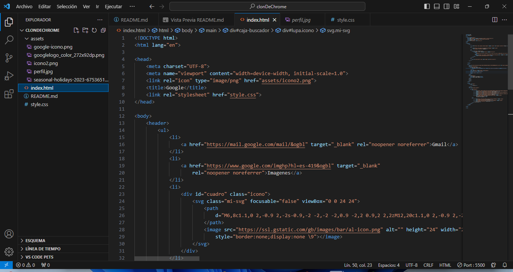

# CLON DE GOOGLE

Proyecto realizado con la intención de aplicar los conocimientos obtenidos en el Bootcamp de TecnolochicasPRO.

## ÍNDICE
1. [Introducción](#introducción)
2. [Demo](#demo)
3. [Lo que construiremos](#lo-que-construiremos)
4. [Objetivos de aprendizaje](#objetivos-de-aprendizaje)
5. [Requisitos para desarrollar el proyecto](#requisitos-para-desarrollar-el-proyecto)
6. [Autoría](#autoría)

****
### Introducción

Este proyecto tiene como objetivo aplicar los conocimientos adquiridos en el Bootcamp de TecnolochicasPRO. Está inspirado en la creación de un clon de la página de inicio de Google, utilizando HTML y CSS. Se busca explorar y practicar conceptos de diseño web y manipulación del DOM.
****
### Demo

****
### Lo que construiremos

El objetivo principal es recrear la apariencia y la funcionalidad de la página de inicio de Google. Se replicarán los elementos visuales principales y se trabajará en la funcionalidad básica de búsqueda, con énfasis en la práctica de diseño responsive y accesibilidad web.
****
### Objetivos de aprendizaje

- Reforzar habilidades en HTML y CSS.
- Comprender y aplicar conceptos de diseño responsive.
- Practicar la manipulación del DOM.
- Mejorar la experiencia del usuario a través de prácticas de accesibilidad web.
****
### Requisitos para desarrollar el proyecto

Para replicar este proyecto, se requiere tener conocimientos básicos en HTML y CSS. Además, se recomienda el uso de un editor de código como Visual Studio Code o cualquier otro de preferencia.
****
### Autoría

Hecho por Melva Santos como parte del Bootcamp de TecnolochicasPRO.

Puedes conocer más sobre mi trabajo en [mi perfil en GitHub](https://github.com/MelvaBosada) o [mi perfil de linkedin personal](https://www.linkedin.com/in/melva-santos-2963b52a3/).
Contacto: msantosbosada14@gmail.com
© 2023 Melva Santos | Miau Miau | (Programa Technolochicas PRO)
